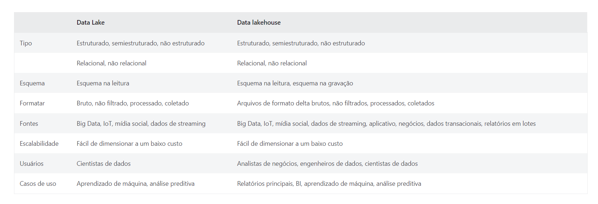

# Data Lake

Referência: GOOGLE CLOUD. O que é data lake?. Disponível em: https://cloud.google.com/learn/what-is-a-data-lake?hl=pt-br#:~:text=O%20data%20lake%20%C3%A9%20um,ignorando%20os%20limites%20de%20tamanho. Acesso em: 26 ago 2022.

<b>"O que é data lake?</b>

O data lake é um repositório centralizado projetado para armazenar, processar e proteger grandes quantidades de dados estruturados, semiestruturados e não estruturados. Ele pode armazenar dados em seu formato nativo e processar qualquer variedade desses dados, ignorando os limites de tamanho.

Um data lake fornece uma plataforma segura e escalonável que permite às empresas: 
- ingerir quaisquer dados de qualquer sistema em qualquer velocidade, mesmo se os dados vierem de sistemas locais, em nuvem ou edge computing;
- armazena qualquer tipo ou volume de dados com total fidelidade; 
- processa dados em tempo real ou em modo de lote; e analisa dados usando SQL, Python, R, ou qualquer outra linguagem, dados de terceiros ou aplicativo analítico.

Embora data lakes e armazenamentos de dados armazenem dados em alguma capacidade, cada um é otimizado para diferentes usos. Considere essas ferramentas complementares em vez de concorrentes, e as empresas podem precisar de ambas. Como um ponto de comparação, os armazenamentos de dados são geralmente ideais para o tipo de relatórios e análises repetíveis que são comuns nas práticas comerciais, como relatórios de vendas mensais, rastreamento de vendas por região ou tráfego de site. 

Ao determinar se sua empresa precisa de um data lake, tenha em mente os tipos de dados com os quais você está trabalhando, o que quer fazer com os dados, a complexidade do seu processo de aquisição de dados e sua estratégia para gerenciamento e governança de dados, bem como as ferramentas e conjuntos de habilidades existentes em sua organização.

As empresas hoje também estão começando a olhar para o valor dos data lakes através de uma lente diferente. Um data lake não é apenas sobre armazenar dados com fidelidade total. Também é sobre os usuários conseguirem uma compreensão mais profunda das situações dos negócios porque eles têm mais contexto do que nunca, o que lhes permite acelerar os experimentos de análise.

Desenvolvido principalmente para lidar com grandes volumes de Big Data, as empresas podem mover normalmente dados brutos por meio de lote e/ou stream para um data lake sem transformá-los. As empresas contam com data lakes de formas estratégicas para ajudar a:

- reduzir o custo total da propriedade;

- simplificar o gerenciamento de dados;

- se preparar para incorporar inteligência artificial e machine learning; 

- acelerar as análises;

- melhorar a segurança e a governança.

<b> Alguns casos de uso de data lake</b>

Como os data lakes fornecem a base para análise e inteligência artificial, ele está sendo usado pelas empresas de todos os setores para aumentar a receita, economizar dinheiro e reduzir riscos.

Mídia e entretenimento:
Uma empresa que oferece streaming de música, rádio e podcasts pode aumentar a receita melhorando seu sistema de recomendação, de modo que os usuários consumam mais seus serviços, permitindo que a empresa venda mais anúncios.

Telecomunicações:
Uma empresa multinacional de telecomunicações pode economizar dinheiro criando modelos de propensão de desligamento de usuários que reduzem o desligamento de clientes.

Serviços financeiros:
Uma empresa de investimento pode contar com data lakes para impulsionar o machine learning, para que possa gerenciar os riscos da carteira assim que os dados do mercado em tempo real estiverem acessíveis."

------------------------------------------------------------------------------------

Referência: AWS.AMAZON. O que é um data lake?. Disponível em: https://aws.amazon.com/pt/big-data/datalakes-and-analytics/what-is-a-data-lake/. Acesso em: 26 ago 2022.

<b>"O que é um data lake?</b>

Um data lake é um repositório centralizado que permite armazenar todos os seus dados estruturados e não estruturados em qualquer escala. Você pode armazenar seus dados como estão, sem precisar primeiro estruturá-los e executar diferentes tipos de análise, desde painéis e visualizações até processamento de big data, análise em tempo real e machine learning para orientar melhores decisões.

Os elementos essenciais de uma solução de data lake e análise

À medida que as organizações estão criando data lakes e uma plataforma de análise, elas precisam considerar vários recursos importantes, incluindo:

Movimentação de dados:
Os data lakes permitem que você importe qualquer quantidade de dados que possa vir em tempo real. Os dados são coletados de várias fontes e movidos para o data lake em seu formato original. Esse processo permite escalar para dados de qualquer tamanho, economizando tempo na definição de estruturas de dados, esquemas e transformações.

Armazene e catalogue dados com segurança:
Os data lakes permitem que você armazene dados relacionais, como bancos de dados operacionais e dados de aplicações de linha de negócios, e dados não relacionais, como aplicativos móveis, dispositivos IoT e mídias sociais. Eles também oferecem a capacidade de entender quais dados estão no lago por meio de crawling, catalogação e indexação de dados. Por fim, os dados devem ser protegidos para garantir que seus ativos de dados estejam protegidos.

Análises:
Os data lakes permitem que várias funções da organização, como cientistas de dados, desenvolvedores de dados e analistas de negócios, acessem dados com sua escolha de ferramentas e frameworks analíticos. Isso inclui frameworks de código aberto, como Apache Hadoop, Presto e Apache Spark, e ofertas comerciais de fornecedores de data warehouse e inteligência empresarial. Os data lakes permitem que você execute análises sem a necessidade de mover seus dados para um sistema de análise separado.

Machine learning:
O data lakes permitirão que as organizações gerem diferentes tipos de insights, incluindo relatórios sobre dados históricos e machine learning, onde os modelos são criados para prever resultados prováveis e sugerir uma série de ações prescritas para alcançar o resultado ideal.

<b>O valor de um data lake</b>

A capacidade de aproveitar mais dados, de mais fontes, em menos tempo, e de capacitar os usuários a colaborar e analisar dados de diferentes maneiras leva a uma tomada de decisão melhor e mais rápida. Exemplos em que os data lakes agregaram valor incluem:

Melhores interações com o cliente:
Um data lake pode combinar dados de clientes de uma plataforma de CRM com análise de mídia social, uma plataforma de marketing que inclui histórico de compras e tíquetes de incidentes para capacitar a empresa a entender o grupo de clientes mais lucrativo, a causa da perda de clientes e as promoções ou recompensas que aumentará a fidelidade.

Melhorar as opções de inovação em P&D:
Um data lake pode ajudar suas equipes de P&D a testar hipóteses, refinar suposições e avaliar resultados, como escolher os materiais certos no design do produto, resultando em uma performance mais rápida, em pesquisas genômicas que levam a medicamentos mais eficazes ou no entendimento da disposição dos clientes de pagar por atributos diferentes.

Aumente as eficiências operacionais:
A Internet das Coisas (IoT) apresenta mais maneiras de coletar dados sobre processos como fabricação, com dados em tempo real provenientes de dispositivos conectados à Internet. Um data lake facilita o armazenamento e a execução de análises em dados de IoT gerados por máquina para descobrir maneiras de reduzir custos operacionais e aumentar a qualidade.

<b>Os desafios dos data lakes</b>

O principal desafio com uma arquitetura de data lake é que os dados brutos são armazenados sem supervisão do conteúdo. Para que um data lake torne os dados utilizáveis, ele precisa ter mecanismos definidos para catalogar e proteger os dados. Sem esses elementos, os dados não podem ser encontrados ou confiáveis, resultando em um “pântano de dados”. Atender às necessidades de públicos mais amplos exige que os data lakes tenham governança, consistência semântica e controles de acesso."

 
------------------------------------------------------------------------------------

Referência: AZURE.MICROSOFT. O que é um data lake?. Disponível em: https://azure.microsoft.com/pt-br/resources/cloud-computing-dictionary/what-is-a-data-lake/#what-is-data-lake-architecture. Acesso em: 26 ago 2022.

"<b>O que é um data lake?</b>

Um data lake é um repositório centralizado que ingere e armazena grandes volumes de dados em sua forma original. Os dados podem ser processados e usados como base para uma variedade de necessidades analíticas. Devido à sua arquitetura aberta e escalonável, um data lake pode acomodar todos os tipos de dados, de qualquer fonte, desde estruturadas (tabelas de banco de dados, planilhas do Excel), semiestruturados (arquivos XML, páginas da Web) até não estruturados (imagens, arquivos de áudio, tweets), tudo sem sacrificar a fidelidade. Os arquivos de dados normalmente são armazenados em zonas preparadas, brutos, limpos e coletados, para que diferentes tipos de usuários possam usar os dados em suas várias formas para atender às suas necessidades. Os data lakes fornecem consistência de dados básica em uma variedade de aplicativos, habilitando a análise de Big Data, o aprendizado de máquina, a análise preditiva e outras formas de ação inteligente.

<b>Os data lakes são importantes?</b>

O mundo altamente conectado e orientado por insights de hoje não seria possível sem o advento de soluções de data lake. Isso ocorre porque as organizações dependem de plataformas abrangentes de data lake, como o Azure Data Lake, para manter os dados brutos consolidados, integrados, seguros e acessíveis. Ferramentas de armazenamento escalonáveis como Azure Data Lake Storage podem armazenar e proteger dados em um local central, eliminando silos a um custo ideal. Isso estabelece a base para que os usuários executem uma ampla variedade de categorias de carga de trabalho, como processamento de Big Data, consultas SQL, mineração de texto, análise de streaming e aprendizado de máquina. Os dados podem ser usados para alimentar a visualização de dados upstream e as necessidades de relatório ad hoc. Uma plataforma de dados moderna e de ponta a ponta, como Azure Synapse Analytics atende às necessidades completas de uma arquitetura de Big Data centralizada no data lake.

<b>Casos de uso de Data Lake</b>

Com uma solução bem arquitetada, o potencial de inovação é infinito. Aqui estão apenas alguns exemplos de como as organizações, em uma variedade de setores, usam plataformas de data lake para otimizar seu crescimento:

- Streaming de mídia -  Empresas de streaming baseadas em assinatura coletam e processam insights sobre o comportamento do cliente, que podem usar para melhorar seu algoritmo de recomendação.

- Finanças - As empresas de investimento usam os dados de mercado mais atualizados, que são coletados e armazenados em tempo real, para gerenciar com eficiência os riscos de portfólio.

- Serviços de saúde - Empresas de serviços de saúde dependem de big data para melhorar a qualidade do atendimento aos pacientes. Os médicos usam grandes quantidades de dados históricos para simplificar os caminhos dos pacientes, resultando em melhores resultados e na redução do custo dos cuidados.

- Varejista da Omnichannel - Os varejistas usam data lakes para capturar e consolidar dados que vêm de vários pontos de toque, incluindo celular, redes sociais, chat, boca a boca e pessoalmente.

- IoT - Sensores de hardware geram quantidades enormes de dados semiestruturados e não estruturados no mundo físico ao redor. Os data lakes fornecem um repositório central no qual essas informações devem ser usadas para análise futura.

- Cadeia de fornecimento digital - Os data lakes ajudam os fabricantes a consolidar dados de armazenamento diferentes, incluindo sistemas EDI, XML e JSONs.

- Vendas - Especialistas em dados e engenheiros de vendas geralmente compilam modelos preditivos para ajudar a determinar o comportamento do cliente e reduzir a rotatividade geral.

<b>Data lake em comparação a data warehouse</b>

Agora você sabe o que data lake é, por quê ele é importante e como é usado em várias organizações. Mas qual é a diferença entre um data lake e um data warehouse? E quando é apropriado usar um ou outro?

Embora data lakes e data warehouses sejam semelhantes, pois armazenam e processam dados, cada um tem suas próprias especialidades e, portanto, seus próprios casos de uso. É por isso que é comum para uma organização de nível empresarial incluir um data lake e um data warehouse em seu ecossistema de análise. Ambos os repositórios trabalham juntos para formar um sistema seguro de ponta a ponta para armazenamento, processamento e tempo de insight mais rápido.

Um data lake captura dados relacionais e não relacionais de uma variedade de fontes: aplicativos de negócios, aplicativos móveis, dispositivos IoT, redes sociais ou streaming - sem precisar definir a estrutura ou o esquema dos dados até que eles sejam lidos. O esquema na leitura garante que qualquer tipo de dados possa ser armazenado em sua forma bruta. Como resultado, os data lakes podem conter uma ampla variedade de tipos de dados, de estruturados a semiestruturados a não estruturados, em qualquer escala. Sua natureza flexível e escalonável os torna essenciais para executar formas complexas de análise de dados usando diferentes tipos de ferramentas de processamento de computação, como o Apache Spark or Azure Machine Learning..

Por outro lado, um data warehouse é relacional por natureza. A estrutura ou o esquema é modelado ou predefinido por requisitos de negócios e produtos que são coletados, conformados e otimizados para operações de consulta SQL. Embora um data lake tenha dados de todos os tipos de estrutura, incluindo dados brutos e não processados, um data warehouse armazena dados que foram tratados e transformados com uma finalidade específica em mente, que podem ser usados para gerar relatórios analíticos ou operacionais. Isso torna os data warehouses ideais para produzir formas mais padronizadas de análise de BI ou para atender a um caso de uso de negócios que já foi definido.

<b>O que é um data lakehouse?</b>

Agora que você sabe a diferença entre um data lake e um data warehouse. Mas qual é a diferença entre um data lake e um data lakehouse? E é necessário ter ambos?

Apesar de suas muitas vantagens, uma data lake tradicional tem suas desvantagens. Como os data lakes podem acomodar todos os tipos de dados, de todos os tipos de fontes, podem ocorrer problemas relacionados ao controle de qualidade, dados corrompidos e particionamento inadequado. Uma configuração mal gerenciada data lake não apenas compromete a integridade dos dados, mas pode levar a gargalos, desempenho lento e riscos de segurança.

É aqui que o data lakehouse entra em cena. Um data lakehouse é uma solução de armazenamento aberta baseada em padrões multifacetados por natureza. Ele pode atender às necessidades de cientistas de dados e engenheiros que realizam análise e processamento profundos de dados, bem como as necessidades de profissionais tradicionais do data warehouse que coletam e publicam dados para business intelligence e relatórios. A vantagem do lakehouse é que cada carga de trabalho pode operar perfeitamente sobre o data lake sem precisar duplicar os dados em outro banco de dados estruturalmente predefinido. Isso garante que todos estão trabalhando nos dados mais atualizados, além de reduzir redundâncias.

Os data lakehouses abordam os desafios dos data lakes tradicionais adicionando uma camada de armazenamento do Delta Lake diretamente sobre a o data lake da nuvem. A camada de armazenamento fornece uma arquitetura analítica flexível que pode lidar com transações ACID (atomicidade, consistência, isolamento e durabilidade) para confiabilidade de dados, integrações de streaming e recursos avançados, como controle de versão de dados e imposição de esquema. Isso permite uma variedade de atividades analíticas no lake, tudo isso sem comprometer a consistência dos dados principais. Embora a necessidade de um lakehouse dependa de quão complexas são suas necessidades, sua flexibilidade e intervalo o torna uma solução ideal para muitas organizações corporativas.

(Fonte: azure.microsoft)

 
<b>O que é a arquitetura de data lake?</b>

No fundo, um data lake é um repositório de armazenamento sem nenhuma arquitetura definida própria. Para aproveitar ao máximo seus recursos, ele requer uma ampla variedade de ferramentas, tecnologias e mecanismos de computação que ajudam a otimizar a integração, o armazenamento e o processamento de dados. Essas ferramentas trabalham juntas para criar uma arquitetura em camadas coesivamente, que é informada por Big Data e executada sobre o data lake. Essa arquitetura também pode formar a estrutura operacional de um data lakehouse. Cada organização tem sua própria configuração exclusiva, mas a maioria das arquiteturas de data lakehouse tem o seguinte:

- Gerenciamento e orquestração de recurso. Um gerenciador de recursos permite que o data lake execute tarefas consistentemente alocando a quantidade correta de dados, recursos e potência de computação para os locais corretos.

- Conectores para fácil acesso. Uma variedade de fluxos de trabalho permite que os usuários acessem e compartilhem facilmente os dados necessários da forma que precisam.

- Análise confiável. Um bom serviço de análise deve ser rápido, escalonável e distribuído. Ele também deve dar suporte a uma variedade de categorias de carga de trabalho em vários idiomas.

- Classificação de dados. A criação de perfil, catálogo e arquivamento de dados ajuda as organizações a manterem o controle do conteúdo, qualidade e localização dos dados.

- Extrair, carregar, transformar (ELT) processos. O ELT refere-se aos processos pelos quais os dados são extraídos de várias fontes e carregados na zona bruta do data lake, depois limpos e transformados após a extração para que os aplicativos possam usá-los prontamente.

- Segurança e suporte. Ferramentas de proteção de dados como mascaramento, auditoria, criptografia e monitoramento de acesso garantem que seus dados permaneçam seguros e privados.

- Governança e administração. Para que a plataforma data lake seja executada da maneira mais suave possível, os usuários devem ser instruídos sobre sua configuração arquitetônica, bem como práticas recomendadas para o gerenciamento de dados e operações."

------------------------------------------------------------------------------------
# Vídeos

Referência: STACK. O que são Data Lakes?. Disponível: https://www.youtube.com/watch?v=DqNdtR1dlgE. Acesso em: 26 ago 2022.

Referência: Software Architecture Academy. Data Lake Architecture. Disponível em: https://www.youtube.com/watch?v=1x0uJzMd1Pg. Acesso em: 26 ago 2022. 

Referência: ECOA PUCRIO. Data Lake Simplificado. Disponível em: https://www.youtube.com/watch?v=02mcV3jkKu8. Acesso em: 26 ago 2022.

