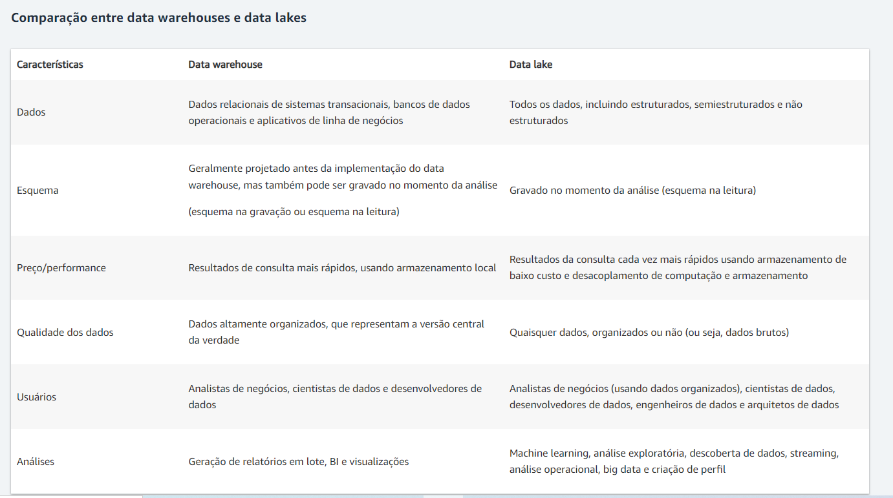
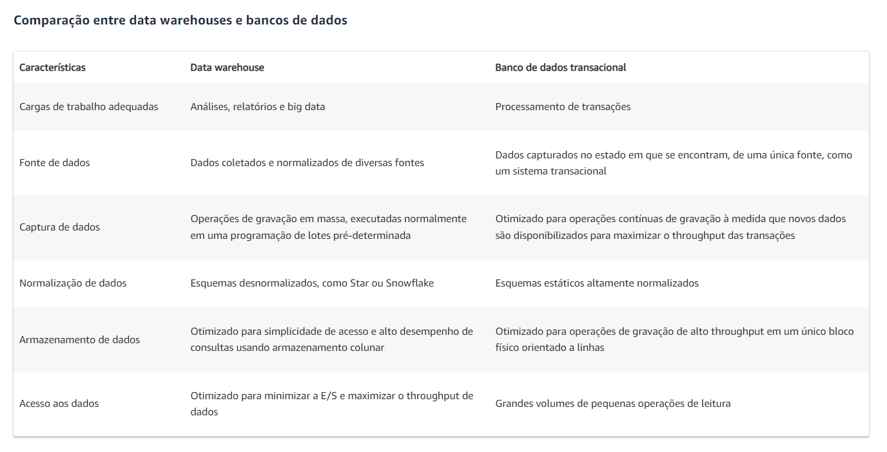
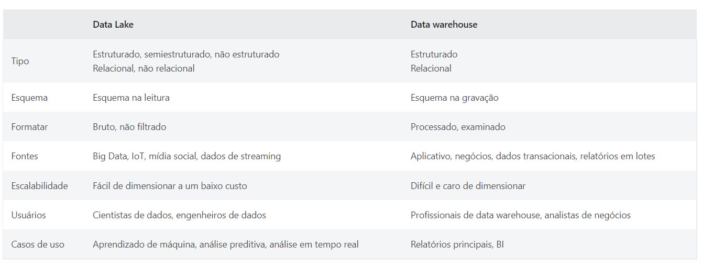

# Data Warehouse

Referência: aws.amazon. Conceitos de Data Warehouse. Disponível em: https://aws.amazon.com/pt/data-warehouse/. Acesso em: 26 ago 2022.

<b>"O que é um data warehouse?</b>

Um data warehouse é um repositório central de informações que podem ser analisadas para tomar decisões mais adequadas. Os dados fluem de sistemas transacionais, bancos de dados relacionais e de outras fontes para o data warehouse, normalmente com uma cadência regular. Analistas de negócios, engenheiros de dados, cientistas de dados e tomadores de decisões acessam os dados por meio de ferramentas de inteligência de negócios (BI), clientes SQL e outros aplicativos de análise.

Dados e análises se tornaram indispensáveis para que as empresas se mantenham competitivas. Os usuários corporativos contam com relatórios, painéis e análises para extrair insights dos dados, monitorar a performance dos negócios e apoiar a tomada de decisões. Os data warehouses alimentam esses relatórios, painéis e ferramentas de análise armazenando dados de maneira eficiente para minimizar a entrada e saída (E/S) dos dados e fornecer resultados de consulta rapidamente para centenas e milhares de usuários simultaneamente.

<b>Como um data warehouse é arquitetado?</b>

Uma arquitetura de data warehouses é composta de camadas. A camada superior é o cliente de front-end, que apresenta os resultados por meio de ferramentas de relatórios, análises e mineração de dados. A camada intermediária consiste no mecanismo de análises, usado para acessar e analisar os dados. A camada inferior da arquitetura é o servidor de banco de dados, onde os dados são carregados e armazenados. Os dados são armazenados de dois modos diferentes: 1) os dados acessados com frequência são armazenados em armazenamento muito rápido (como unidades SSD) e 2) os dados acessados com pouca frequência são armazenados em um armazenamento de objetos barato, como o Amazon S3. O data warehouse garantirá automaticamente que os dados acessados com frequência sejam movidos para o armazenamento "rápido", para otimizar a velocidade da consulta.

<b>Como funciona um data warehouse?</b>

Um data warehouse pode conter vários bancos de dados. Dentro de cada banco de dados, os dados são organizados em tabelas e colunas. Dentro de cada coluna, você pode definir uma descrição dos dados, como número inteiro, campo de dados ou sequência. As tabelas podem ser organizadas dentro de esquemas, que você pode considerar como pastas. Quando os dados são consumidos, eles são armazenados em várias tabelas descritas pelo esquema. As ferramentas de consulta usam o esquema para determinar as tabelas de dados que serão acessadas e analisadas.

<b>Quais são os benefícios de usar um data warehouse?</b>

Os benefícios de um data warehouse incluem o seguinte:

- Tomada de decisão adequada

- Dados consolidados de várias fontes

- Análise de dados históricos

- Qualidade, consistência e precisão de dados

- Separação do processamento analítico dos bancos de dados transacionais, o que melhora o desempenho dos dois sistemas

Um data warehouse é projetado especificamente para análises de dados, que envolvem a leitura de grandes quantidades de dados para compreender relações e tendências entre os dados. Um banco de dados é usado para capturar e armazenar dados, como o registro de detalhes de uma transação.

Ao contrário de um data warehouse, um data lake é um repositório centralizado para todos os dados, incluindo estruturados, semiestruturados e não estruturados. Um data warehouse exige que os dados sejam organizados em um formato tabular, onde o esquema torna-se necessário. O formato tabular é necessário para que o SQL possa ser usado para consultar os dados, mas nem todos os aplicativos exigem que os dados estejam em formato de tabela."

(Fonte: aws.amazon)

(Fonte: aws.amazon)

 
 
------------------------------------------------------------------------------------

Referência: ORACLE. O que é um Data Warehouse?. Disponível em: https://www.oracle.com/br/database/what-is-a-data-warehouse/. Acesso em: 26 ago 2022.

"<b>Data Warehouse definido</b>

Um data warehouse é um tipo de sistema de gerenciamento de dados projetado para ativar e fornecer suporte às atividades de business intelligence (BI), especialmente a análise avançada. Os data warehouses destinam-se exclusivamente a realizar consultas e análises avançadas e geralmente contêm grandes quantidades de dados históricos. Os dados em um data warehouse geralmente são derivados de uma ampla variedade de fontes, como arquivos de log de aplicativos e aplicativos de transações.

Um data warehouse centraliza e consolida grandes quantidades de dados de várias fontes. Seus recursos analíticos permitem que as organizações obtenham informações de negócios úteis de seus dados para melhorar a tomada de decisões. Com o tempo, cria-se um registro histórico que pode ser inestimável para cientistas de dados e analistas de negócios. Devido a esses recursos, um data warehouse pode ser considerado como a “única fonte confiável” de uma organização.

Um data warehouse típico geralmente inclui os seguintes elementos:

- Um banco de dados relacional para armazenar e gerenciar dados

- Uma solução de extração, carregamento e transformação (ELT) para preparar os dados para análise

- Análise estatística, relatórios e recursos de mineração de dados

- Ferramentas de análise de clientes para visualizar e apresentar dados aos usuários de negócios

- Outras aplicações analíticas mais sofisticadas que geram informações acionáveis aplicando ciência de dados e algoritmos de inteligência artificial (IA) ou gráficos e recursos espaciais que permitem mais tipos de análise de dados em escala

<b>Benefícios de um Data Warehouse</b>

Os data warehouses oferecem o benefício único e abrangente de permitir que as organizações analisem grandes quantidades de dados variantes e extraiam um valor significativo, além de manter um registro histórico.

Quatro características únicas (descritas pelo cientista da computação William Inmon, que é considerado o pai do data warehouse) permitem que os data warehouses forneçam esse benefício abrangente. De acordo com essa definição, os data warehouses são

- Orientados para o assunto. Eles podem analisar dados sobre um determinado assunto ou área funcional (como vendas).

- Integrados. Os data warehouses criam consistência entre diferentes tipos de dados de fontes distintas.

- Não volátil. Quando os dados estão em um data warehouse, eles são estáveis e não mudam.

- Variáveis de acordo com o tempo. A análise de data warehouse analisa as mudanças ao longo do tempo.

Um data warehouse bem projetado realizará consultas muito rapidamente, fornecerá alta taxa de transferência de dados e dará flexibilidade suficiente para os usuários finais dividirem e organizarem ou reduzirem o volume de dados para um exame mais detalhado a fim de atender a uma variedade de demandas, seja em um nível alto ou em um nível muito bom e detalhado. O data warehouse serve como a base funcional para ambientes de BI de middleware que fornecem aos usuários finais relatórios, painéis e outras interfaces.

<b>Arquitetura de Data Warehouse</b>

A arquitetura de um data warehouse é determinada pelas necessidades específicas da organização. Arquiteturas comuns incluem

- Simples. Todos os data warehouses compartilham um design básico no qual metadados, dados de resumo e dados brutos são armazenados no repositório central do warehouse. O repositório é alimentado por fontes de dados em uma extremidade e acessado por usuários finais para análise, relatório e mineração na outra extremidade.

- Simples com uma área de preparo. Os dados operacionais devem ser limpos e processados antes de serem colocados no warehouse. Embora isso possa ser feito de forma programática, muitos data warehouses adicionam uma área de preparo de dados antes que eles entrem no warehouse, para simplificar a preparação dos dados.

- Hub e spoke. A adição de data marts entre o repositório central e os usuários finais permite que uma organização personalize seu data warehouse para atender a várias linhas de negócios. Quando os dados estiverem prontos para uso, eles serão movidos para o data mart apropriado.

- Áreas restritas. As áreas restritas são áreas privadas, seguras e protegidas que permitem às empresas explorar rápida e informalmente novos conjuntos de dados ou formas de analisar dados sem ter que obedecer ou cumprir as regras formais e o protocolo do data warehouse.

<b>Planejamento de um Data Warehouse</b>

Quando uma organização se propõe a projetar um data warehouse, ela deve começar definindo seus requisitos de negócios específicos, concordando com o escopo e elaborando um projeto conceitual. A organização pode então criar o design lógico e físico para o data warehouse. O design lógico envolve as relações entre os objetos e o design físico envolve a melhor maneira de armazenar e recuperar os objetos. O design físico também incorpora os processos de transporte, backup e recuperação.

Todo design de data warehouse de dados deve abordar o seguinte:

- Conteúdo de dados específicos

- Relacionamentos dentro e entre grupos de dados

- O ambiente de sistemas que fornecerá suporte ao data warehouse.

- Os tipos de transformações de dados necessários

- Frequência de atualização de dados

Um fator primário no design são as necessidades dos usuários finais. A maioria dos usuários finais está interessada em realizar análises e analisar dados agregados, em vez de transações individuais. No entanto, muitas vezes os usuários finais realmente não sabem o que querem até que surja uma necessidade específica. Assim, o processo de planejamento deve incluir exploração suficiente para antecipar as necessidades. Finalmente, o design do data warehouse deve permitir espaço para expansão e evolução para acompanhar as necessidades em evolução dos usuários finais.

<b>A Nuvem e o Data Warehouse</b>

Os data warehouses na nuvem oferecem as mesmas características e os benefícios dos data warehouses on-premise, mas com os benefícios adicionais da computação em nuvem, como flexibilidade, escalabilidade, agilidade, segurança e custos reduzidos. Os data warehouses em nuvem permitem que as empresas se concentrem unicamente na extração de valor de seus dados, em vez de precisarem construir e gerenciar a infraestrutura de hardware e software para fornecer suporte ao data warehouse."

------------------------------------------------------------------------------------

Referência:  AZURE.MICROSOFT. O que é um data warehouse?. Disponível em: https://azure.microsoft.com/pt-br/resources/cloud-computing-dictionary/what-is-a-data-warehouse/#data-warehouse-tools. Acesso em: 26 ago 2022.

<b>"O que é um data warehouse?</b>

Um data warehouse é um repositório centralizado que armazena dados estruturados (tabelas de banco de dados, planilhas do Excel) e dados semiestruturados (arquivos XML, páginas da Web) para fins de relatório e análise. Os dados fluem de uma variedade de fontes, como sistemas de ponto de venda, aplicativos de negócios e bancos de dados relacionais, e geralmente são limpos e padronizados antes de atingirem o depósito. Como um data warehouse pode armazenar grandes quantidades de informações, ele fornece aos usuários acesso fácil a uma grande quantidade de dados históricos, que podem ser usados para mineração de dados, visualização de dados e outras formas de relatórios de business intelligence.

<b>Data lake em comparação a data warehouse</b>

É claro que os data warehouses são essenciais para as operações de análise de qualquer organização. Mas qual é a diferença entre um data warehouse e outros tipos de repositórios de dados, como um data lake? E quando um ou o outro devem ser usados?

Como repositórios, os data warehouses e data lakes armazenam e processam dados. No entanto, embora pareçam oferecer a mesma funcionalidade, cada um deles tem seus próprios casos de uso específicos. É por isso que as organizações normalmente incorporam os dois sistemas para formar uma solução completa de ponta a ponta que pode lidar com uma ampla variedade de finalidades.

Um data warehouse é relacional por natureza. Isso significa que a estrutura ou o esquema dos dados é determinado por requisitos predefinidos de negócios e produtos que são coletados e otimizados para operações de consulta SQL. Como resultado, os data warehouses são mais usados para armazenar dados que foram tratados com uma finalidade específica em mente, como mineração de dados para análise de BI ou para fornecimento de um caso de uso de negócios que já foi identificado.

Como data warehouses, os data lakes contêm dados estruturados e semiestruturados. No entanto, eles também são capazes de acomodar dados brutos e não processados de uma variedade de fontes não relacionais, incluindo aplicativos móveis, dispositivos IoT, mídia social ou streaming. Isso ocorre porque a estrutura ou o esquema em um data lake não é definido até que os dados sejam lidos. Como resultado de sua natureza flexível e escalonável, os data lakes geralmente são usados para executar formas inteligentes de análise de dados, como aprendizado de máquina.

(Fonte: azure.microsof)

 

<b>Arquitetura e design do data warehouse</b>

Um data warehouse é mais do que apenas um único silo operando por conta própria. Em vez disso, é um sistema altamente estruturado e cuidadosamente arquitetado composto por várias camadas que interagem com seus dados e entre si de maneiras diferentes. Normalmente, essas camadas incluem:

A camada inferior: 
Os dados são ingeridos de várias fontes e, em seguida, limpos e transformados para que outros aplicativos os usem em um processo chamado ETL (extração, transformação e carregamento). A camada inferior também é onde os dados são armazenados e otimizados, o que leva a tempos de consulta mais rápidos e melhor desempenho geral.

Camada intermediária:
É aqui que você encontrará o mecanismo de análise, também conhecido como servidor OLAP (processamento analítico online). Os servidores OLAP acessam grandes volumes de dados do data warehouse em uma alta velocidade, o que leva a resultados extremamente rápidos.

Camada superior:
A camada superior é onde a interface de front-end apresenta visualmente os dados processados, que os analistas podem acessar e usar para todas as suas necessidades de relatórios e BI de autoatendimento."

----------------------------------------------------------------------------------

# Vídeos

DICIONÁRIO DE INFORMÁTICA. Data Warehouse e o depósito de dados. Disponível em: https://www.youtube.com/watch?v=5ow87RFFEaY. Acesso em 26 ago 2022.

Prof. Claudio Bonel, M.Sc. Visão geral sobre Data Warehouse. Disponível em: https://www.youtube.com/watch?v=XPEBG4kkaFM. Acesso em 26 ago 2022.

UNIVESP. Banco de Dados - Introdução a Views e conceitos básicos sobre Data Warehouse e Data Lake. Disponível em: https://www.youtube.com/watch?v=_A9KDi_Cl-8. Acesso em 26 ago 2022.

